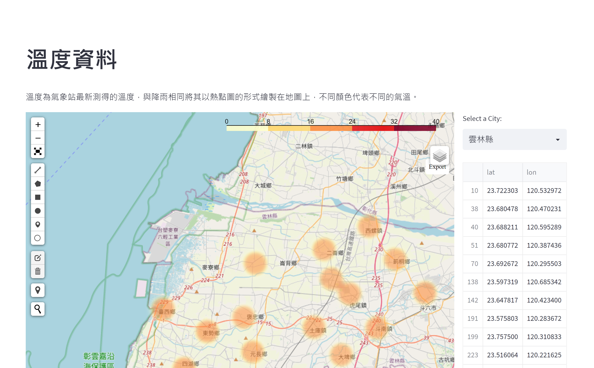

# Instructions

This is a simple website which is builded by streamlit and deployed on Heroku.

This website is used to demo meteorological informations on leaflet. The data is from [Central Weather Bureau](https://opendata.cwb.gov.tw/dataset/observation/O-A0001-001)

There are several kinds of meteorological information：

a)Rainfall information

b)Rain gauge information

c)Earthquake

d)Temperature

## Demo

